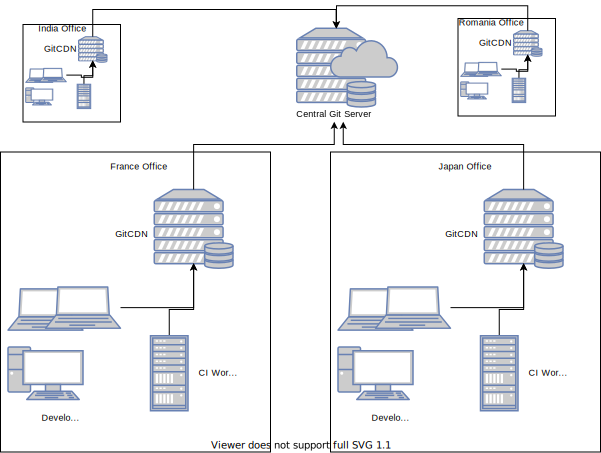

# git-cdn

a CDN for git

[](https://gitlab.com/grouperenault/git_cdn/commits/master)
[](http://grouperenault.gitlab.io/git_cdn/coverage/index.html)

git-cdn is a git mirror that you can place near your CI workers and developers.
It acts as a git+http(s) proxy, reducing WAN usage and accelerating git access for large repositories.

<div align="center">

</div>

git-cdn is an on-demand mirror and only updates its local cache when requested by a client.
This means that the mirror is always guaranteed to return the latest version from the central repository.
Other git mirroring solution (gitlab geo-replication, gerrit mirror) are cron or event based, and there is always a difference between the central repository and mirrors which makes it hard for continuous integration workers to use the mirrors.

git-cdn is super easy to setup:

1) Deploy one 90MB container on a powerful machine.
2) Create an nginx frontend for load balancing and SSL termination.

## Technical features

- Fully stateless for horizontal scalability

- Supports BasicAuth over https authentication (auth check is made by forcing a call to upstream, by reusing the BasicAuth creds)
    - There is no super use creds needed to be stored in the mirror
    - SSH auth is not supported, thus.

- Git protocol v1 only. v2 can be implemented, at the price of more complex code (not yet done).

- Git-LFS objects are cached.

- Pack results are cached (when 20 workers are requesting the same git update, it will only be computed once).

- Push (aka receive-pack) operations are implemented as a simple proxy, they will just forward to upstream server, without any smarts.
  This simplifies the git-config, avoiding to configure pushInsteadOf and http_proxy

- Fast bootstrap of huge android repositories with clone.bundle in google storage.

- Tested with Gitlab, but should work with any BasicAuth git+http(s) server.

- Production ready. Already served peta bytes of git data for Renault SW Labs CI.

## QuickStart

Docker image is available on Gitlab registry:

    mkdir ~/gitCDN
    docker run -it -p 8000:8000 -v $HOME/gitCDN:/git-data -e GITSERVER_UPSTREAM=https://gitlab.example.com/ -e WORKING_DIRECTORY=/git-data registry.gitlab.com/grouperenault/git_cdn


Edit your git config

    [url "http://localhost:8000/"]
        insteadOf = https://gitlab.example.com/

Then just use git as usual:

    git clone https://gitlab.example.com/org/project.git

## Production setup

### Server Requirement

- git-cdn load by itself is negligible. Most load is generated by git process generating the packs.
- N CPU, N GB RAM, where N is the number of **simultaneous** git requests you expect to have is a good rule of thumb.
- SSD hard-drive is a big speed up as git operation are IO intensive.
- SSL is necessary as BasicAuth is used and is only secure when used over SSL.

### Setup Server

We think systemd + docker + nginx is the easiest way to run git_cdn in production environment.
We actually use ansible to deploy all that but this goes beyond the purpose of this documentation.

1) Create a new systemd service (as root)

```bash
curl -O /etc/systemd/system/gitcdn.service https://gitlab.com/grouperenault/git_cdn/-/raw/master/deploy/gitcdn.service
# edit the template file to customize upstream server
vi /etc/systemd/system/gitcdn.service
systemctl daemon-reload
systemctl enable gitcdn
systemctl start gitcdn
```

2) Create nginx conf (as root)

```bash
curl -O /etc/nginx/conf.d/git-cdn.conf https://gitlab.com/grouperenault/git_cdn/-/raw/master/deploy/git-cdn.conf
# edit and customize this conf (SSL certificate configuration is needed)
vi /etc/nginx/conf.d/git-cdn.conf
systemctl restart nginx
```


### Setup User config

Provided git_cdn.intra.example.com is the DNS for your git_cdn server, users need to add this snipet to their ``~/.gitconfig``:

```ini
[url "https://git_cdn.intra.example.com/"]
    insteadOf = https://gitlab.example.com/
```

### Configuration

As it is meant to be run via docker, git-cdn is configured via environment variables.

Here is the list and default values.

```bash
# basic mandatory configuration
GITSERVER_UPSTREAM=         # centralised git server (http url)
WORKING_DIRECTORY=          # directory where to put cache files

# gunicorn config
GUNICORN_WORKER=8           # number of asyncio loops managed by gunicorn
GUNICORN_WORKER_CLASS=      # specify different worker class

# logging configuration
LOGGING_SERVER=             # logging server (json over udp), works great with vector.dev. If not set, logging to console
SENTRY_DSN=                 # sentry DSN to use for sending crash reports

# pack cache configuration
PACK_CACHE_SIZE_GB=20       # size of the cache for git packs
    # following 2 params will increase cache size and decrease cache hit ratio
PACK_CACHE_MULTI=false      # set to true to also cache multiple ref packs
PACK_CACHE_DEPTH=false      # set to true to also cache when clone depth is used

# proxy config
https_proxy=                # proxy to use to communicate with git server
BUNDLE_PROXY=               # proxy to use to fetch git bundles from AOSP CDN

# Network stability workarounds
# sometimes the complexity of our networks create some connection loss.
# git-cdn will automatically retry transparently from the actual client (when possible).
REQUEST_MAX_RETRIES=10      # Number of retries that happen for http requests proxified directly to upstream.
BACKOFF_START=0.5           # exponential backoff timer to use between upstream git fetch retries (doubles for each try)
BACKOFF_COUNT=5             # backoff retry count for git fetch retries

MAX_CONNECTIONS=10          # Maximum number of connection that git_cdn will create to upstream server per gunicorn worker
GIT_SSL_NO_VERIFY=          # can be used for staging infra when self signed SSL certificates are used (not for prod!)

# protection from git hangs
GIT_PROCESS_WAIT_TIMEOUT=2  # time to wait before killing git process (after sending sigterm)
```

# How it works

Git HTTP protocol is divided into two phases.


During the first phase (GET), the client verify that the server is implementing RPC, and ask the list of refs that the server has for that repository.
For that phase, git-cdn acts as a simple proxy, it does not interfer in anyway with the results, nor uses any cached data. This allow to ensure that the client always has the latest commit.

Then, for the next phase, the client sends a POST message with the list of object that he has, and the list of object that he wants. The server is supposed to send him only the bare minimum of object in order to reconstruct the branch that is needed.
During that phase, git-CDN acts as a smart caching proxy, he sends the list of HAVE and WANTS to a local git process, and tries to resolve the client needs locally.
If that does not work, then it will try to fetch new data from the upstream server and then retry to resolve the client needs.
Git-cdn always use local git in order to fetch new data, in order to optimistically fetch all the new data from server.

## Retry States

If the local cache fails to address the upload-pack request, several retries are made, and

-   If the directory does not exist, directly go to state 3
-   state 1: Retry after taking the write lock. Taking the write lock means a parallel request may have updated the database in parallel. We retry without talking to upstream
-   state 2: Retry after fetching every branches of upstream
-   state 3: Assuming the repository is corrupted, we remove the directory and clone from scratch
-   state 4: Failed to answer to the request, give up and forward the error

# Clone-bundles

git-cdn supports clone bundles as a way to quickly bootstrap huge android AOSP environment.
This is especially useful when git-cdn is located far away from upstream server.
This feature only works when used jointly with repo:

-   repo by default downloads a `_clone.bundle` file and use that instead of full clone
-   git-cdn looks in "https://storage.googleapis.com/gerritcodereview/android_{}_clone.bundle" (configurable via CDN_BUNDLE_URL environment variable)
-   git-cdn first performs a http HEAD command and parses the headers to find-out if the bundle exists, and to get the up-to data md5sum and file size.
-   git-cdn proxy and caches this file in \$WORKING_DIRECTORY/bundles directory
-   git-cdn makes sure the bundle has same size and checksum as advertised by bundle_url (md5 checksum must be advertised as `x-goog-hash: md5=$(md5hash_base64` header))
-   repo initialise its own local copy with the bundle, the performs a git fetch to git-cdn
-   git-cdn checks whether it has a bundle for this module in its cache directory, then inits its local copy with the bundle
-   git-cdn synchronise remaining objects from upstream, and then serves the upload-pack as usual

# upload-pack cache

During the a git clone, git computes a 'pack' file, specially crafted for the client.
The client gives its list of have and want commits number, and git computes the exact list of objects needed to reconstruct the git database attached to those commits (including history).
In the case of a full git clone, by default, the whole git database is sent in practice.
Implementation details make that git decompress and recompress the whole database as the format used for networking is slightly different from the format used for on-disk storage.
In the general developer workflow this is quite efficient as network is the constrained ressource, and developers are always doing frequent fetches, so git makes sure we only send the minimal set of data to the client.
In the context of a docker based CI, where working directly is always thrown away for security and/or reproducibility reasons this is very inefficient as the git server will constantly be re-generating full git-clone data.

Thus, git_cdn implements a cache for 'git clone' packs.
By default, git_cdn only caches single_branch clones. It is recommended to configure the CI jobs to use the ``--single-branch`` clone method, and only download the needed branch. As a result, this will decrease the number of objects that are needed to transfer, and also sightly increase the cache hit ratio.

You can configure the cache characteristics using PACK_CACHE_* environment variables.

## Performance and security

Git-cdn takes a number of design decision in order to keep security and performance without needing configuration.

-   clone bundle is always fetched from the same cdn url, and always use the basename of the repo url to find the name of the bundle.
    This means the android repositories must always be stored in git repository with their AOSP canonic url path, with '/' replaced by '\_'.
    e.g. `platform/external/javapoet.git` is stored in upstream as `platform_external_javapoet.git` (directory is ignored)

-   clone bundles are shared by canonic name, means you can have several android trees in your upstream git server, and all will use the same bundle.

-   clone bundle can be downloaded without credentials. Those are bundles for AOSP, and are freely available. This means anybody can use your git-cdn to download and consume storage space, limited by the size of what Google publishes. You can set empty CDN_BUNDLE_URL environment variable to disable the feature.

-   clone bundle are huge, and repo download them in parallel. In order to limit the memory and cpu impact, the file are streamed from client and server, and md5sum is calculated during the transfer. If at the end of the transfer, git-cdn figure out that the checksum is wrong, the cache file is deleted (evicted, so next download will download from Google), but the client still has its transfer completed (at that time, it is too late in http protocol to fail the download). The repo client will anyway always verify the coherency of the bundle (git bundles have a sha1 checksum in their header and all their objects).

-   git-cdn uses the name of the repo to implicitely find the clone.bundle to use for init. This means that if somebody creates a project with name platform_external_javapoet, and git-cdn already has a platform_external_javapoet bundle in its bundle directory, then the git-cdn copy will be initialised with unneeded objects from the bundle. This does not impact the functionality, but may impact performance of git gc, and storage space

## Git version sensitive

    Several time some issues came from git version changes. To investigate with different git
    versions you can do:
    ```bash
    $ git clone https://github.com/git/git
    $ git checkout v2.19.1
    $ make all install DESTDIR=/tmp/git_2.19.1
    $ git checkout v2.17.1
    $ make all install DESTDIR=/tmp/git_2.17.1
    ```
    Then try a test with a specific git version, example:
    ```bash
    $ V=19 GIT_EXEC_PATH=/tmp/git_2.$V.1/home/renault/libexec/git-core PATH=/tmp/git_2.$V.1/home/renault/bin:$PATH pipenv run pytest -v git_cdn/tests/test_upload_pack.py::test_shallow_trunc2[pyloop]
    $ V=17 GIT_EXEC_PATH=/tmp/git_2.$V.1/home/renault/libexec/git-core PATH=/tmp/git_2.$V.1/home/renault/bin:$PATH pipenv run pytest -v git_cdn/tests/test_upload_pack.py::test_shallow_trunc2[pyloop]
    ```

# Log and Trace

Git-cdn uses structured logging methodology to have context based structured logging.
As git-cdn is massively parallel using asyncio, this is necessary in order to follow any problematic request.

At the moment, only the main logic upload_pack.py is using contextual logging.

In order to enable structure logging you need to configure a server, listening for json over UDP.

    LOGGING_SERVER=vector.dev.example.com:12201

[Vector](https://vector.dev) using udp source, and json transform is easy to setup. It will process and filter those logs, and
support many "sinks" to store your logs.

# Setup for development:

```bash
$ make dev
```

Fix code style:

```bash
$ make style
```

Checks (code style, lint, pep8...):

```bash
$ make check
```

Test:

```bash
$ make test
```

Run the app locally:

```bash
$ make run
```

Add package in Pipfile:

```bash
$ pipenv install --dev mydevdependency
$ pipenv install myproddependency
```


# License

MIT
