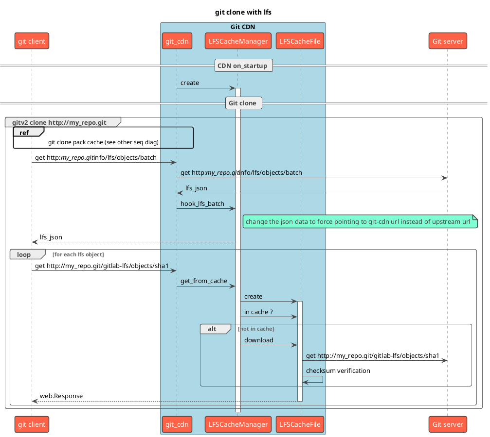

```plantuml
@startuml
!theme vibrant

title git clone with lfs

participant "git client" as gc
box "Git CDN" #LightBlue
participant "git_cdn" as gcdn
participant LFSCacheManager as lfs
participant LFSCacheFile as lfsf
end box
participant "Git server" as gs

== CDN on_startup ==
gcdn -> lfs: create
activate lfs

== Git clone ==
group  gitv2 clone http://my_repo.git
  ref over gc, gcdn: git clone pack cache (see other seq diag)

  gc -> gcdn: get http://my_repo.git//info/lfs/objects/batch
  gcdn -> gs: get http://my_repo.git//info/lfs/objects/batch
  gcdn <- gs: lfs_json
  gcdn -> lfs: hook_lfs_batch
  note right lfs: change the json data to force pointing to git-cdn url instead of upstream url
  gc <-- lfs: lfs_json

  loop for each lfs object
    gc -> gcdn: get http://my_repo.git/gitlab-lfs/objects/sha1
    gcdn -> lfs: get_from_cache
    lfs -> lfsf: create
    activate lfsf
    lfs -> lfsf: in cache ?
    alt not in cache
      lfs -> lfsf: download
      lfsf -> gs: get http://my_repo.git/gitlab-lfs/objects/sha1
      lfsf -> lfsf: checksum verification
    end
    gc <-- lfsf: web.Response
    deactivate lfsf
  end

end
@enduml
```
