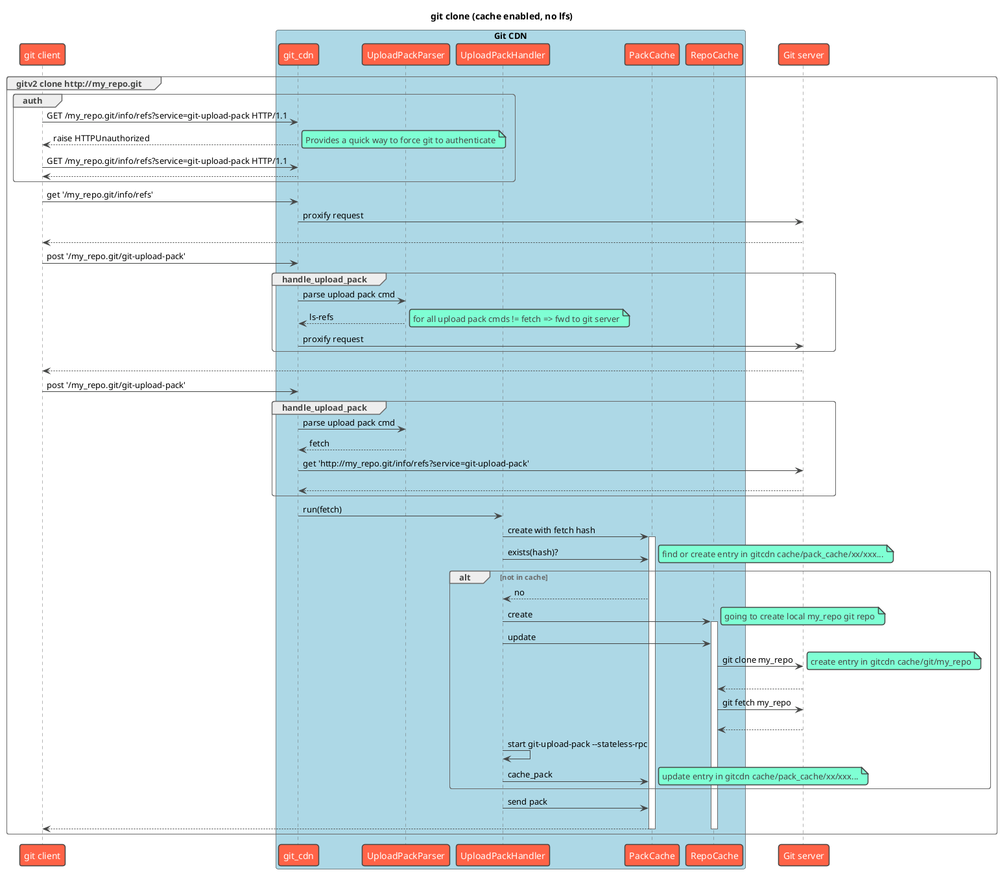

```plantuml
@startuml
!theme vibrant

title git clone (cache enabled, no lfs)

participant "git client" as gc
box "Git CDN" #LightBlue
participant "git_cdn" as gcdn
participant UploadPackParser as upp
participant UploadPackHandler as uph
participant PackCache as pc
participant RepoCache as rc
end box
participant "Git server" as gs


group  gitv2 clone http://my_repo.git
  group auth
    gc -> gcdn: GET /my_repo.git/info/refs?service=git-upload-pack HTTP/1.1
    gc <-- gcdn: raise HTTPUnauthorized
    note right: Provides a quick way to force git to authenticate
    gc -> gcdn: GET /my_repo.git/info/refs?service=git-upload-pack HTTP/1.1
    gc <-- gcdn:
  end

  gc -> gcdn: get '/my_repo.git/info/refs'​
  gcdn -> gs: proxify request​
  gs --> gc:​

  gc -> gcdn: post '/my_repo.git/git-upload-pack'​
  group handle_upload_pack
    gcdn -> upp: parse upload pack cmd​
    gcdn <-- upp: ls-refs​
    note right: for all upload pack cmds != fetch => fwd to git server
    gcdn -> gs: proxify request​
  end
  gs --> gc: ​

  gc -> gcdn: post '/my_repo.git/git-upload-pack'​
  group handle_upload_pack
    gcdn -> upp: parse upload pack cmd​
    gcdn <-- upp: fetch​
    gcdn -> gs: get 'http://my_repo.git/info/refs?service=git-upload-pack'​
    gs --> gcdn:​
  end

  gcdn -> uph: run(fetch)​
  uph -> pc: create with fetch hash​
  activate pc
  uph -> pc: exists(hash)?​
  note right: find or create entry in gitcdn cache/pack_cache/xx/xxx...

  alt not in cache
    uph <-- pc: no
    uph -> rc: create
    note right: going to create local my_repo git repo
    activate rc
    uph -> rc: update​
    rc -> gs: git clone my_repo​
    note right: create entry in gitcdn cache/git/my_repo​
    rc <-- gs:​
    rc -> gs: git fetch my_repo​
    rc <-- gs:​
    uph -> uph: start git-upload-pack --stateless-rpc​
    uph -> pc: cache_pack​
    note right: update entry in gitcdn cache/pack_cache/xx/xxx...​
  end

  uph -> pc: send pack​
  pc --> gc: ​
  deactivate pc
  deactivate rc

end
@enduml
```
