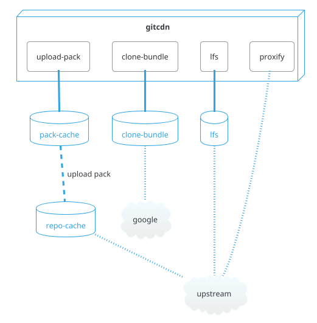

```plantuml
@startuml
!theme cerulean-outline

node gitcdn {
    agent "upload-pack" as gup
    agent "clone-bundle" as gcbd
    agent lfs as glfs
    agent proxify as gp
}

database "clone-bundle" as cbd
database "repo-cache" as rc
database "pack-cache" as pc
database lfs
cloud upstream
cloud google

gcbd -- cbd
gup -- pc
glfs -- lfs
pc .. rc: upload pack

gp ~~ upstream
rc ~~ upstream
lfs ~~ upstream

cbd ~~ google
@enduml
```
